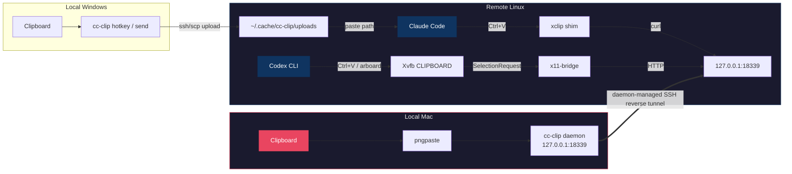

<p align="center">
  
</p>
<h1 align="center">cc-clip</h1>
<p align="center">
  <b>Paste images &amp; receive notifications across SSH — remote Claude Code &amp; Codex CLI feel local.</b>
</p>
<p align="center">
  <a href="https://github.com/fancy-potato/cc-clip/releases"></a>
  <a href="LICENSE"></a>
  <a href="https://go.dev"></a>
  <a href="https://github.com/fancy-potato/cc-clip/stargazers"></a>
</p>

<p align="center">
  
  <br>
  <em>Install → setup → paste. Clipboard works over SSH.</em>
</p>

---

<details>
<summary><b>Table of Contents</b></summary>

- [The Problem](#the-problem)
- [The Solution](#the-solution)
- [Why cc-clip?](#why-cc-clip)
- [Quick Start](#quick-start)
- [Daily Usage](#daily-usage)
- [SSH Notifications](#ssh-notifications)
- [Common Troubleshooting](#common-troubleshooting)
- [How It Works](#how-it-works)
- [Persistent Tunnels & SwiftBar](#persistent-tunnels--swiftbar)
- [Multi-laptop on a Shared Remote Account](#multi-laptop-on-a-shared-remote-account)
- [Reference](#reference)
- [Uninstall](#uninstall)
- [Upgrading from pre-daemon-tunnel releases](#upgrading-from-pre-daemon-tunnel-releases)
- [Contributing](#contributing)
- [Related](#related)
- [License](#license)

</details>

---

## The Problem

When running Claude Code or Codex CLI on a remote server via SSH, **image paste often doesn't work** and **notifications don't reach you**. The remote clipboard is empty — no screenshots, no diagrams. And when Claude finishes a task or needs approval, you have no idea unless you're staring at the terminal.

## The Solution

```text
Image paste:
  Claude Code (macOS):   Mac clipboard     → cc-clip daemon → SSH tunnel → xclip shim      → Claude Code
  Claude Code (Windows): Windows clipboard → cc-clip hotkey → SSH/SCP    → remote file path → Claude Code
  Codex CLI:             Mac clipboard     → cc-clip daemon → SSH tunnel → x11-bridge/Xvfb → Codex CLI

Notifications:
  Claude Code hook → cc-clip-hook → SSH tunnel → local daemon → macOS/cmux notification
  Codex notify     → cc-clip notify             → SSH tunnel → local daemon → macOS/cmux notification
```

One tool. No changes to Claude Code or Codex. Clipboard and notifications both work over SSH.

## Why cc-clip?

| Approach | Works over SSH? | Any terminal? | Image support? | Setup complexity |
|----------|:-:|:-:|:-:|:--:|
| Native Ctrl+V | Local only | Some | Yes | None |
| X11 Forwarding | Yes (slow) | N/A | Yes | Complex |
| OSC 52 clipboard | Partial | Some | Text only | None |
| **cc-clip** | **Yes** | **Yes** | **Yes** | **One command** |

---

## Quick Start

> **Windows users:** follow the dedicated [Windows Quick Start](docs/windows-quickstart.md). The rest of this section covers macOS.

### Prerequisites

- **Local:** macOS 13+
- **Remote:** Linux (amd64 or arm64) reachable over SSH
- **SSH config:** a literal `Host <alias>` entry in `~/.ssh/config` (wildcards, symlinked configs, and `Include`-only aliases are not supported)
- **SSH auth:** key in `ssh-agent` or passwordless — the daemon's tunnel uses `BatchMode=yes` and cannot prompt for a passphrase

If you don't have an alias yet:

```
# ~/.ssh/config
Host myserver
    HostName 10.0.0.1
    User your-username
    IdentityFile ~/.ssh/id_rsa   # optional
```

Use the alias (`myserver`), not `user@host`, everywhere below.

### Step 1: Install

```bash
curl -fsSL https://raw.githubusercontent.com/fancy-potato/cc-clip/main/scripts/install.sh | sh
```

If `~/.local/bin` isn't in your PATH yet:

```bash
echo 'export PATH="$HOME/.local/bin:$PATH"' >> ~/.zshrc   # or ~/.bashrc
source ~/.zshrc
```

Verify:

```bash
cc-clip --version
```

> **"zsh: killed" on first run?** macOS Gatekeeper is blocking the binary: `xattr -d com.apple.quarantine ~/.local/bin/cc-clip`

### Step 2: Setup

```bash
cc-clip setup myserver
```

One command does everything:

1. Installs `pngpaste` locally.
2. Starts the local daemon (macOS launchd, auto-start on login).
3. Deploys the binary and shim to the remote server.
4. Reserves a remote port and starts the daemon-managed reverse tunnel.

Optional flags:

- `--codex` — also deploy Codex CLI support (Xvfb + x11-bridge).
- `--no-tunnel` — skip auto-starting the tunnel; bring it up later with `cc-clip tunnel up myserver`.

<details>
<summary>Codex CLI prerequisites</summary>

`--codex` needs `Xvfb` on the remote. If auto-install fails, run on the remote:

```bash
sudo apt install xvfb                    # Debian/Ubuntu
sudo dnf install xorg-x11-server-Xvfb    # RHEL/Fedora
```

Then re-run `cc-clip setup myserver --codex`.

</details>

### Step 3: First paste

Copy an image to your Mac clipboard (e.g. `Cmd+Shift+Ctrl+4`), then:

```bash
ssh myserver
claude          # or: codex
# press Ctrl+V in the prompt — the image lands in the model
```

Interactive `ssh` sessions do not touch the tunnel — the daemon keeps it alive in the background. Open and close shells freely.

### Verify

```bash
cc-clip doctor --host myserver
```

End-to-end health check: daemon, tunnel, shim priority, token, notification path.

---

## Daily Usage

After initial setup your workflow is just:

```bash
ssh myserver
claude          # Claude Code — Ctrl+V pastes your Mac clipboard
codex           # Codex CLI  — Ctrl+V pastes your Mac clipboard
```

The daemon runs under launchd (`KeepAlive=true`) and restarts saved tunnels automatically on login and after network flaps. On Linux, run `cc-clip serve` in a terminal multiplexer or wire it into systemd.

### Notifications out of the box

If you ran `cc-clip setup` (or `cc-clip connect`), the notification path is already wired: Codex `notify` is auto-configured (when `~/.codex/` exists on the remote), and the notification nonce is registered and synced.

You only need to make sure `cc-clip-hook` is in your remote Claude Code `Stop` and `Notification` hook arrays — see [SSH Notifications](#ssh-notifications) for how.

### Windows workflow

Some `Windows Terminal → SSH → tmux → Claude Code` combos don't trigger the remote `xclip` path. cc-clip ships a Windows-native workflow based on a `Alt+Shift+V` hotkey + SCP upload that does not depend on clipboard interception. Full guide: [Windows Quick Start](docs/windows-quickstart.md).

---

## SSH Notifications

When Claude Code or Codex CLI runs on a remote server, **notifications don't work over SSH** — `TERM_PROGRAM` isn't forwarded, hooks execute on the remote where `terminal-notifier` doesn't exist, and tmux swallows OSC sequences. cc-clip acts as a transport bridge: remote hook events travel through the same SSH tunnel used for clipboard, and the local daemon delivers them to macOS Notification Center or cmux.

### What you'll see

| Event | Notification | Example |
|-------|-------------|---------|
| Claude finishes responding | "Claude stopped" + last message preview | `Claude stopped: I've implemented the notification bridge...` |
| Claude needs tool approval | "Tool approval needed" + tool name | `Tool approval needed: Claude wants to Edit cmd/main.go` |
| Codex task completes | "Codex" + completion message | `Codex: Added error handling to fetch module` |
| Image pasted via Ctrl+V | "cc-clip #N" + fingerprint + dimensions | `cc-clip #3: a1b2c3d4 . 1920x1080 . PNG` |
| Duplicate image detected | Same + duplicate marker | `cc-clip #4: Duplicate of #2` |

- **Sequence number** (#1, #2, #3…) lets you detect gaps (e.g. #1 → #3 means #2 was lost).
- **Duplicate detection** alerts when the same image is pasted twice within 5 images.
- **Click the notification** to open the full image in Preview.app (macOS, requires `terminal-notifier`).

### Hook configuration

`cc-clip setup` / `connect` already installed `cc-clip-hook` at `~/.local/bin/cc-clip-hook` on the remote. All that's left is to register it in Claude Code's hook arrays. The easiest way is to ask Claude Code itself — SSH into the server, start Claude Code, and paste:

```
Please add cc-clip-hook to my Claude Code hooks configuration. Add it to both Stop and
Notification hooks in ~/.claude/settings.json. The command is just "cc-clip-hook" (it's
already in PATH at ~/.local/bin/). Keep any existing hooks — just append cc-clip-hook
alongside them. Show me the diff before and after.
```

<details>
<summary>Manual hook configuration</summary>

Edit `~/.claude/settings.json` on the **remote server**:

```json
{
  "hooks": {
    "Stop": [
      { "hooks": [{ "type": "command", "command": "cc-clip-hook" }] }
    ],
    "Notification": [
      { "hooks": [{ "type": "command", "command": "cc-clip-hook" }] }
    ]
  }
}
```

If you already have hooks there, append a new entry — don't replace. Restart Claude Code (hooks are read at startup).

</details>

<details>
<summary>Manual nonce registration (only if you skipped <code>cc-clip connect</code>)</summary>

```bash
# Local Mac:
NONCE=$(openssl rand -hex 32)
curl -s -X POST -H "Authorization: Bearer $(head -1 ~/.cache/cc-clip/session.token)" \
  -H "User-Agent: cc-clip/0.1" -H "Content-Type: application/json" \
  -d "{\"nonce\":\"$NONCE\"}" http://127.0.0.1:18339/register-nonce
ssh myserver "mkdir -p ~/.cache/cc-clip && echo '$NONCE' > ~/.cache/cc-clip/notify.nonce && chmod 600 ~/.cache/cc-clip/notify.nonce"
```

</details>

### Notifications don't appear

<details>
<summary>Step-by-step verification on the remote</summary>

```bash
# 1. Is the tunnel working?
curl -sf --connect-timeout 2 http://127.0.0.1:18339/health
# Expected: {"status":"ok"}

# 2. Hook script installed?
grep "curl" ~/.local/bin/cc-clip-hook
# Expected: a curl command with --connect-timeout

# 3. Nonce file present?
cat ~/.cache/cc-clip/notify.nonce
# Expected: 64-character hex string

# 4. Manual test:
echo '{"hook_event_name":"Stop","stop_hook_reason":"stop_at_end_of_turn","last_assistant_message":"test"}' | cc-clip-hook
# Expected: Mac notification popup

# 5. Health log:
cat "${CC_CLIP_STATE_DIR:-$HOME/.cache/cc-clip}/notify-health.log"
```

| Problem | Fix |
|---------|-----|
| Tunnel down (step 1 fails) | `cc-clip tunnel list`, kill any stale remote listener, re-run `cc-clip tunnel up myserver` |
| Old hook script (step 2 empty) | `cc-clip connect myserver` |
| Missing nonce (step 3 fails) | See "Manual nonce registration" above |
| Daemon running old binary | Rebuild (`make build`) and restart (`cc-clip serve`) |

</details>

---

## Common Troubleshooting

```bash
cc-clip doctor --host myserver
```

<details>
<summary><b>"zsh: killed" after installation</b></summary>

macOS Gatekeeper blocks unsigned binaries:

```bash
xattr -d com.apple.quarantine ~/.local/bin/cc-clip
```

Or reinstall (the latest install script handles this):

```bash
curl -fsSL https://raw.githubusercontent.com/fancy-potato/cc-clip/main/scripts/install.sh | sh
```

</details>

<details>
<summary><b>"cc-clip: command not found"</b></summary>

`~/.local/bin` is not in PATH:

```bash
echo 'export PATH="$HOME/.local/bin:$PATH"' >> ~/.zshrc
source ~/.zshrc
```

</details>

<details>
<summary><b>Ctrl+V doesn't paste images (Claude Code)</b></summary>

```bash
# Replace <local-daemon-port> (default 18339) and <remote-port>
# (from `cc-clip tunnel list` for this host).

# 1. Local daemon running?
curl -s http://127.0.0.1:<local-daemon-port>/health
# Expected: {"status":"ok"}

# 2. Tunnel forwarding?
ssh myserver "curl -s http://127.0.0.1:<remote-port>/health"
# Expected: {"status":"ok"}

# 3. Shim taking priority?
ssh myserver "which xclip"
# Expected: ~/.local/bin/xclip   (NOT /usr/bin/xclip)

# 4. Shim intercepts? (image on Mac clipboard first)
ssh myserver 'CC_CLIP_DEBUG=1 xclip -selection clipboard -t TARGETS -o'
# Expected: image/png
```

If step 2 fails: `cc-clip tunnel list` then `cc-clip tunnel up myserver`. If step 3 fails: `source ~/.bashrc` / `source ~/.zshrc` in the SSH session; see "Fresh SSH session still misses PATH or DISPLAY" below for a persistent fix.

</details>

<details>
<summary><b>Interactive SSH tab warns "remote port forwarding failed for listen port …"</b></summary>

You're upgrading from a pre-daemon-tunnel release. See [Upgrading from pre-daemon-tunnel releases](#upgrading-from-pre-daemon-tunnel-releases) for the one-time manual cleanup.

</details>

<details>
<summary><b>Ctrl+V doesn't paste images (Codex CLI)</b></summary>

> **Most common cause:** empty `DISPLAY`. Open a **new** SSH session after setup — existing sessions don't pick up the updated shell rc file.

```bash
# On the remote:

# 1. DISPLAY set?
echo $DISPLAY
# Expected: 127.0.0.1:0 (or :1, etc.). If empty → NEW ssh session, or source ~/.bashrc.

# 2. Tunnel up?
curl -s http://127.0.0.1:<remote-port>/health

# 3. Xvfb running?
ps aux | grep Xvfb | grep -v grep

# 4. x11-bridge running?
ps aux | grep 'cc-clip x11-bridge' | grep -v grep

# 5. X11 socket?
ls -la /tmp/.X11-unix/

# 6. xclip reads via X11? (image on Mac clipboard first)
xclip -selection clipboard -t TARGETS -o
# Expected: image/png
```

| Step fails | Fix |
|-----------|-----|
| 1 (DISPLAY empty) | Open a **new** SSH session. If still empty: `source ~/.bashrc` or `source ~/.zshrc` |
| 2 (tunnel down) | Local: `cc-clip tunnel list`, then `cc-clip tunnel up myserver` |
| 3–4 (processes missing) | `cc-clip connect myserver --codex --force` from local |
| 6 (no image/png) | Copy an image on Mac first (`Cmd+Shift+Ctrl+4`) |

> DISPLAY uses TCP loopback format (`127.0.0.1:N`) rather than Unix socket (`:N`) because Codex CLI's sandbox blocks `/tmp/.X11-unix/`. If you set up cc-clip with an older version, re-run `cc-clip connect myserver --codex --force`.

</details>

<details>
<summary><b>Fresh SSH session still misses PATH or DISPLAY</b></summary>

Some login-shell setups don't source `~/.bashrc` or `~/.zshrc` on SSH login.

Quick fix for the current shell:

```bash
source ~/.bashrc
# or
source ~/.zshrc
```

Persistent fix for bash login shells:

```bash
printf '\n[ -f ~/.bashrc ] && . ~/.bashrc\n' >> ~/.bash_profile
```

If your system uses `~/.profile` instead of `~/.bash_profile`, add the same line there.

</details>

<details>
<summary><b>Setup fails because you passed <code>user@host</code> instead of an alias</b></summary>

cc-clip expects an SSH alias that resolves via `ssh -G <alias>`. Define one:

```sshconfig
Host myserver
    HostName example.com
    User alice
```

Then run:

```bash
cc-clip setup myserver
ssh myserver
```

</details>

<details>
<summary><b>Stale sshd process blocks the remote port</b></summary>

Tunnel reports `disconnected` with "address already in use":

```bash
ssh myserver "sudo ss -tlnp | grep <remote-port>"   # find the PID
ssh myserver "sudo kill <PID>"
cc-clip tunnel up myserver
```

</details>

<details>
<summary><b>Token expired after 30+ days of inactivity</b></summary>

```bash
cc-clip connect myserver --token-only
```

Token uses sliding expiration — auto-renews on every use.

</details>

<details>
<summary><b>Launchd daemon can't find pngpaste</b></summary>

```bash
cc-clip service uninstall && cc-clip service install
```

Regenerates the plist with the correct PATH.

</details>

<details>
<summary><b>Setup fails: "killed" during re-deployment</b></summary>

The launchd service is holding the old binary. Rebuild in the right order:

```bash
cc-clip service uninstall
curl -fsSL https://raw.githubusercontent.com/fancy-potato/cc-clip/main/scripts/install.sh | sh
cc-clip setup myserver
```

</details>

More: [Troubleshooting Guide](docs/troubleshooting.md) or `cc-clip doctor --host myserver`.

---

## How It Works



1. **macOS Claude path:** the local daemon reads your Mac clipboard via `pngpaste`, serves images on loopback, and the remote `xclip` shim fetches through the SSH tunnel.
2. **Windows Claude path:** the local hotkey reads your Windows clipboard, uploads the image over SSH/SCP, and pastes the remote file path into the active terminal.
3. **Codex CLI path:** `x11-bridge` claims `CLIPBOARD` ownership on a headless Xvfb and serves images on-demand when Codex reads the clipboard via X11.
4. **Notification path:** remote Claude Code hooks and Codex notify events pipe through `cc-clip-hook` → SSH tunnel → local daemon → macOS Notification Center or cmux.

**The daemon, not your interactive SSH session, owns the reverse tunnel.** cc-clip does not write `RemoteForward` / `ControlMaster` / `ControlPath` into `~/.ssh/config`; it spawns its own `ssh -N -R` process and keeps it alive with auto-reconnect. The one narrow exception is a managed `# >>> cc-clip SetEnv (do not edit) >>>` block appended inside an existing `Host <alias>` entry — used only for the [multi-laptop shared-account](#multi-laptop-on-a-shared-remote-account) scenario.

### Security

| Layer | Protection |
|-------|-----------|
| Network | Loopback only (`127.0.0.1`) — never exposed |
| Clipboard auth | Bearer token with 30-day sliding expiration (auto-renews on use) |
| Notification auth | Dedicated nonce per-connect session (separate from clipboard token) |
| Tunnel control auth | Local-only token, never synced to the remote |
| Token delivery | Via stdin, never in command-line args |
| Notification trust | Hook notifications marked `verified`; generic JSON shows `[unverified]` prefix |
| Transparency | Non-image calls pass through to the real `xclip` unchanged |

---

## Persistent Tunnels & SwiftBar

The cc-clip daemon owns the reverse tunnel end-to-end: it spawns its own `ssh -N -R` process and keeps the forward alive with auto-reconnect, independent of any interactive `ssh` session. The commands below are the management surface.

```bash
cc-clip tunnel list                 # show status per host
cc-clip tunnel up   myserver        # start (also re-reads ~/.ssh/config)
cc-clip tunnel down myserver        # pause without forgetting
cc-clip tunnel remove myserver      # stop + delete saved state
```

`tunnel up` auto-detects the remote port from the state file that `cc-clip connect` wrote under `~/.cache/cc-clip/tunnels/`. Tunnels survive daemon restarts — `LoadAndStartAll()` re-establishes them on startup.

**One local daemon port (default `18339`) handles all remote hosts.** Each host gets its own remote port from the remote peer registry. You do not need a different `--port` per host; only pass one when you deliberately run multiple daemon instances (rare — e.g. isolating work vs. personal).

<details>
<summary>Picking up <code>~/.ssh/config</code> changes</summary>

The first `cc-clip tunnel up <host>` runs `ssh -G <host>`, caches the expansion (HostName, User, IdentityFile, ProxyCommand, …) into the tunnel's state file, and reuses the cached snapshot on every reconnect and daemon restart. This is a deliberate security pin: a later edit to `~/.ssh/config` cannot silently change the `ssh` argv the daemon spawns on the next network flap.

**To pick up your edit, re-run `cc-clip tunnel up <host>`.** That's the canonical "tell cc-clip about my new SSH config" command. Editing `~/.ssh/config` alone is not enough.

</details>

<details>
<summary>Port / daemon model (deep)</summary>

- **Allocation source of truth:** the remote peer registry. `cc-clip connect` reserves the remote listen port there.
- **Local runtime source:** the tunnel state file at `~/.cache/cc-clip/tunnels/<sanitized-host>-<localPort>-<hash>.json`. `tunnel up` / `list` / `doctor` all read it; `tunnel up` does not SSH back to the remote to re-look-up the port.
- **Local daemon port:** defaults to `18339`. Override with `--port` or `CC_CLIP_PORT`.
- A persistent tunnel's `local_port` (the target of `ssh -R <remote>:127.0.0.1:<local>`) always equals the owning daemon's HTTP port — the reverse forward is only useful if it lands where a daemon is listening.
- `tunnel up` / `down` / `remove` all accept `--port`. When omitted, `tunnel up` adopts the daemon port recorded in the state file whenever ownership is unambiguous.
- To act on a specific daemon in a multi-daemon setup, point `--port` or `CC_CLIP_PORT` at that daemon.

</details>

> **Requirement:** Persistent tunnels use `BatchMode=yes`. Your SSH key must be in `ssh-agent` or passwordless. Run `ssh-add` if needed.
>
> **Token rotation:** The tunnel-control token at `~/.cache/cc-clip/tunnel-control.token` is local-only. Rotate with `cc-clip serve --rotate-tunnel-token`; the CLI and SwiftBar plugin pick up the fresh token on the next invocation.

### SwiftBar menu bar plugin

[SwiftBar](https://github.com/swiftbar/SwiftBar) is a macOS menu bar app that runs shell scripts and renders their output. The included plugin shows tunnel status at a glance.

```
● 2/3    2 of 3 tunnels connected
```

**Install:**

```bash
brew install --cask swiftbar
brew install jq

ln -s "$(pwd)/scripts/cc-clip-tunnels.30s.sh" \
    ~/Library/Application\ Support/SwiftBar/Plugins/
```

Use an absolute path for the symlink so it keeps working when you move your shell elsewhere. The `30s` in the filename tells SwiftBar to refresh every 30 seconds.

**What you'll see:**

| Menu bar | Meaning |
|----------|---------|
| `● 2/2` (green) | All tunnels connected |
| `● 1/2` (orange) | Some tunnels disconnected |
| `⊘ 0/2` (gray) | All tunnels down |
| `⊘` | No tunnels configured |

Click for per-host status, port mapping, PID, reconnect count, last error, and per-host **Start** / **Stop** buttons (each sent to that tunnel's recorded local daemon port).

---

## Multi-laptop on a Shared Remote Account

If two or more laptops SSH into the **same** Unix account on the remote, each laptop reserves a unique remote port in the per-peer registry, but the shared `clipcc` / `cc-clip-hook` / xclip shim scripts only carry the most recent setup's port as their fallback. Fix: push per-laptop env vars at SSH login so each session steers the shared shims at the right port and per-peer state directory.

<details>
<summary>Full multi-laptop setup</summary>

### Step 1: Server admin — allow env passthrough (one-time)

Edit `/etc/ssh/sshd_config` and add (or merge into an existing `AcceptEnv` line):

```
AcceptEnv CC_CLIP_PORT CC_CLIP_STATE_DIR
```

Reload sshd:

```bash
sudo systemctl reload ssh       # Debian/Ubuntu
# or: sudo systemctl reload sshd    # RHEL/Fedora
```

### Step 2: On each laptop — run setup as usual

`cc-clip setup <host>`, `cc-clip connect <host>`, and `cc-clip connect <host> --token-only` automatically append or refresh a managed block **inside your existing `Host <host>` entry** in `~/.ssh/config`:

```
Host myalias
  HostName server.example.com
  User shareduser
  # >>> cc-clip SetEnv (do not edit) >>>
  SetEnv CC_CLIP_PORT=18340 CC_CLIP_STATE_DIR=/home/shareduser/.cache/cc-clip/peers/<peerID>
  # <<< cc-clip SetEnv (do not edit) <<<
```

**Preconditions:**

- You already have a `Host <host>` block. cc-clip does not create one.
- The `Host <host>` block must live in the **top-level** `~/.ssh/config`. cc-clip does not walk `Include` directives (walking them would let a path-traversal exploit in an included file rewrite an unrelated one), so a `Host` block buried in `Include ~/.ssh/config.d/*` is invisible.
- `~/.ssh/config` must be a regular file (not a symlink). cc-clip refuses to rewrite a symlink because replacing it would detach the path from your dotfiles target.
- **Wildcard entries (`Host *`, `Host *.example.com`) are unsupported** — env vars would leak to every matching host.
- If the matching `Host <alias>` already contains a user-authored `SetEnv`, cc-clip warns and refuses to inject its own block. OpenSSH only honors the first `SetEnv` directive; merge `CC_CLIP_PORT` and `CC_CLIP_STATE_DIR` into that first directive manually.
- Requires OpenSSH 7.8+ on the client (released 2018-08).

`cc-clip uninstall --host <host> --peer` removes the managed block after the remote PATH cleanup succeeds. Plain `cc-clip uninstall --host <host>` preserves it (so a workstation only removing the remote PATH marker does not silently lose its per-peer routing env).

### Step 3: Verify

```bash
ssh <host> 'echo "$CC_CLIP_PORT $CC_CLIP_STATE_DIR"'
# should print your reserved port and per-peer state dir
```

If both are empty: the server's `AcceptEnv` is missing or sshd has not been reloaded. If `CC_CLIP_PORT` is empty but the SetEnv block is present locally: your laptop's OpenSSH is older than 7.8 — upgrade if possible.

</details>

---

## Reference

### Essential commands

| Command | Description |
|---------|-------------|
| `cc-clip setup <host>` | Full setup: deps, daemon, deploy, tunnel |
| `cc-clip tunnel list` | Show tunnel status per host |
| `cc-clip tunnel up <host>` | Start (or refresh `ssh -G` cache for) a tunnel |
| `cc-clip doctor --host <host>` | End-to-end health check |
| `cc-clip connect <host> --token-only` | Fast token resync |
| `cc-clip uninstall --host <host> --peer` | Full remote + peer cleanup |

<details>
<summary>All commands</summary>

| Command | Description |
|---------|-------------|
| `cc-clip setup <host>` | Full setup: deps, daemon, deploy, tunnel state |
| `cc-clip setup <host> --codex` | Full setup including Codex CLI support |
| `cc-clip setup <host> --no-tunnel` | Full setup but skip auto-starting the tunnel |
| `cc-clip connect <host>` | Deploy to remote (incremental) |
| `cc-clip connect <host> --codex` | Deploy with Codex support (Xvfb + x11-bridge) |
| `cc-clip connect <host> --token-only` | Sync token only (fast) |
| `cc-clip connect <host> --force` | Full redeploy ignoring cache |
| `cc-clip connect <host> --no-tunnel` | Deploy + persist tunnel state without auto-starting |
| `cc-clip tunnel list [--json]` | List persistent tunnels |
| `cc-clip tunnel up <host> [--remote-port N]` | Start a persistent tunnel (re-reads `~/.ssh/config`; explicit `--remote-port` overrides only the remote-port lookup) |
| `cc-clip tunnel down <host>` | Stop the tunnel owned by the current daemon (select with `--port` / `CC_CLIP_PORT`) |
| `cc-clip tunnel remove <host>` | Stop and delete the tunnel's saved state |
| `cc-clip serve` | Start daemon in foreground |
| `cc-clip serve --rotate-token` | Start daemon with forced new clipboard session token |
| `cc-clip serve --rotate-tunnel-token` | Start daemon with forced new tunnel-control token |
| `cc-clip service install` | Install macOS launchd service |
| `cc-clip service uninstall` | Remove launchd service |
| `cc-clip service status` | Show service status |
| `cc-clip send [<host>]` | Upload clipboard image to a remote file |
| `cc-clip send [<host>] --paste` | Windows: paste uploaded remote path into the active window |
| `cc-clip hotkey [<host>]` | Windows: run a background remote-paste hotkey listener |
| `cc-clip hotkey --enable-autostart` | Windows: start hotkey listener at login |
| `cc-clip hotkey --disable-autostart` | Windows: remove hotkey auto-start at login |
| `cc-clip hotkey --status` | Windows: show hotkey status |
| `cc-clip hotkey --stop` | Windows: stop the hotkey listener |
| `cc-clip notify --title T --body B` | Send a generic notification through the tunnel |
| `cc-clip notify --from-codex "$1"` | Parse Codex JSON arg and notify |
| `cc-clip notify --from-codex-stdin` | Read Codex JSON from stdin and notify |
| `cc-clip doctor` | Local health check |
| `cc-clip doctor --host <host>` | End-to-end health check |
| `cc-clip status` | Show component status |
| `cc-clip install --target <target>` | Install a local `xclip` or `wl-paste` shim |
| `cc-clip uninstall` | Remove a local shim (`auto` picks the single installed one) |
| `cc-clip uninstall --target <target>` | Remove the specified local shim explicitly |
| `cc-clip uninstall --host <host>` | Remove the remote PATH marker only |
| `cc-clip uninstall --host <host> --peer` | Remote PATH + peer lease + notification assets + local tunnel state + managed `SetEnv` block |
| `cc-clip uninstall --codex` | Remove local Codex DISPLAY marker |
| `cc-clip uninstall --codex --host <host>` | Remove Codex support from the remote |

</details>

### Configuration

All settings have sensible defaults. The local daemon port defaults to `18339`.

| Setting | Default | Env var |
|---------|---------|---------|
| Local daemon port | 18339 | `CC_CLIP_PORT` |
| Token TTL | 30d | `CC_CLIP_TOKEN_TTL` |
| Debug logs | off | `CC_CLIP_DEBUG=1` |

<details>
<summary>All settings</summary>

| Setting | Default | Env var |
|---------|---------|---------|
| Local daemon port | 18339 | `CC_CLIP_PORT` |
| Token TTL | 30d | `CC_CLIP_TOKEN_TTL` |
| Output dir | `$XDG_RUNTIME_DIR/claude-images` | `CC_CLIP_OUT_DIR` |
| Probe timeout | 500ms | `CC_CLIP_PROBE_TIMEOUT_MS` |
| Fetch timeout | 5000ms | `CC_CLIP_FETCH_TIMEOUT_MS` |
| Debug logs | off | `CC_CLIP_DEBUG=1` |

</details>

### Platform support

| Local | Remote | Status |
|-------|--------|--------|
| macOS (Apple Silicon) | Linux (amd64) | Stable |
| macOS (Intel) | Linux (arm64) | Stable |
| Windows 10/11 | Linux (amd64/arm64) | Experimental ([`send` / `hotkey`](docs/windows-quickstart.md)) |

### Requirements

- **Local (macOS):** macOS 13+, `pngpaste` (auto-installed by `cc-clip setup`)
- **Local (Windows):** Windows 10/11 with PowerShell, `ssh`, and `scp` in `PATH`
- **Remote:** Linux with `xclip`, `curl`, `bash`, and SSH access
- **Remote (Codex `--codex`):** also requires `Xvfb`. Auto-installed if passwordless sudo is available; otherwise `sudo apt install xvfb` (Debian/Ubuntu) or `sudo dnf install xorg-x11-server-Xvfb` (RHEL/Fedora)

---

## Uninstall

cc-clip no longer ships `uninstall-all.sh` / `uninstall-local.sh`. For a full removal, run the subcommands in order:

```bash
# Remote: release peer lease, remove remote PATH marker, delete local tunnel state for this host.
# `--peer` auto-discovers your local peer id (see `cc-clip status` for the value).
# Use `--peer-id self` to force this workstation's cleanup path when local identity files are gone;
# pass `--peer-id <id>` only when cleaning up a different workstation's lease.
cc-clip uninstall --host myserver --peer

# Remote Codex assets (only if you used --codex)
cc-clip uninstall --codex --host myserver

# Local Codex DISPLAY marker (only if you used --codex)
cc-clip uninstall --codex

# Local xclip / wl-paste shim
cc-clip uninstall

# Local daemon
cc-clip service uninstall
```

> **Shared account:** when multiple laptops share a Unix account on the remote, `uninstall --host H --peer` queries the remote peer registry and leaves `~/.local/bin/clipcc`, `~/.local/bin/cc-clip-hook`, the remote PATH marker, and the Codex `# >>> cc-clip notify >>>` block in place until the **last** peer uninstalls. Run the command on every laptop to force full cleanup. If the registry query itself fails (ssh down, corrupt registry), shared assets are also preserved on purpose — fix the registry and rerun.

If you upgraded from a pre-daemon-tunnel release, also see [Upgrading from pre-daemon-tunnel releases](#upgrading-from-pre-daemon-tunnel-releases).

---

## Upgrading from pre-daemon-tunnel releases

Older `cc-clip` releases wrote a `# >>> cc-clip managed host: … >>>` block into `~/.ssh/config` containing `RemoteForward` / `ControlMaster no` / `ControlPath none` directives. Current cc-clip no longer uses or manages this block — the daemon owns the reverse tunnel directly.

**Symptom after upgrade:** opening `ssh myserver` in a fresh tab prints

```
Warning: remote port forwarding failed for listen port <port>
```

because the daemon already holds the forward. The warning is harmless — clipboard and notifications continue to work through the daemon-owned tunnel.

**Fix (manual, one-time):** open `~/.ssh/config` and delete everything between

```
# >>> cc-clip managed host: myserver >>>
...
# <<< cc-clip managed host: myserver <<<
```

inclusive. cc-clip intentionally does **not** auto-clean this block during `setup`, `connect`, or `uninstall` — the migration surface is deliberately a one-time manual step. The newer managed block (`# >>> cc-clip SetEnv (do not edit) >>>`) is unrelated and is managed automatically.

---

## Contributing

Contributions welcome! For bug reports and feature requests, [open an issue](https://github.com/fancy-potato/cc-clip/issues).

For code contributions:

```bash
git clone https://github.com/fancy-potato/cc-clip.git
cd cc-clip
make build && make test
```

- **Bug fixes:** open a PR directly with a clear description of the fix
- **New features:** open an issue first to discuss the approach
- **Commit style:** [Conventional Commits](https://www.conventionalcommits.org/) (`feat:`, `fix:`, `docs:`, etc.)

## Related

**Claude Code — Clipboard:**
- [anthropics/claude-code#5277](https://github.com/anthropics/claude-code/issues/5277) — Image paste in SSH sessions
- [anthropics/claude-code#29204](https://github.com/anthropics/claude-code/issues/29204) — xclip/wl-paste dependency

**Claude Code — Notifications:**
- [anthropics/claude-code#19976](https://github.com/anthropics/claude-code/issues/19976) — Terminal notifications fail in tmux/SSH
- [anthropics/claude-code#29928](https://github.com/anthropics/claude-code/issues/29928) — Built-in completion notifications
- [anthropics/claude-code#36885](https://github.com/anthropics/claude-code/issues/36885) — Notification when waiting for input (headless/SSH)
- [anthropics/claude-code#29827](https://github.com/anthropics/claude-code/issues/29827) — Webhook/push notification for permission requests
- [anthropics/claude-code#36850](https://github.com/anthropics/claude-code/issues/36850) — Terminal bell on tool approval prompt
- [anthropics/claude-code#32610](https://github.com/anthropics/claude-code/issues/32610) — Terminal bell on completion
- [anthropics/claude-code#40165](https://github.com/anthropics/claude-code/issues/40165) — OSC-99 notification support assumed, not queried

**Codex CLI — Clipboard:**
- [openai/codex#6974](https://github.com/openai/codex/issues/6974) — Linux: cannot paste image
- [openai/codex#6080](https://github.com/openai/codex/issues/6080) — Image pasting issue
- [openai/codex#13716](https://github.com/openai/codex/issues/13716) — Clipboard image paste failure on Linux
- [openai/codex#7599](https://github.com/openai/codex/issues/7599) — Image clipboard does not work in WSL

**Codex CLI — Notifications:**
- [openai/codex#3962](https://github.com/openai/codex/issues/3962) — Play a sound when Codex finishes (34 comments)
- [openai/codex#8929](https://github.com/openai/codex/issues/8929) — Notify hook not getting triggered
- [openai/codex#8189](https://github.com/openai/codex/issues/8189) — WSL2: notifications fail for approval prompts

**Terminal / Multiplexer:**
- [manaflow-ai/cmux#833](https://github.com/manaflow-ai/cmux/issues/833) — Notifications over SSH+tmux sessions
- [manaflow-ai/cmux#559](https://github.com/manaflow-ai/cmux/issues/559) — Better SSH integration
- [ghostty-org/ghostty#10517](https://github.com/ghostty-org/ghostty/discussions/10517) — SSH image paste discussion

## License

[MIT](LICENSE)
