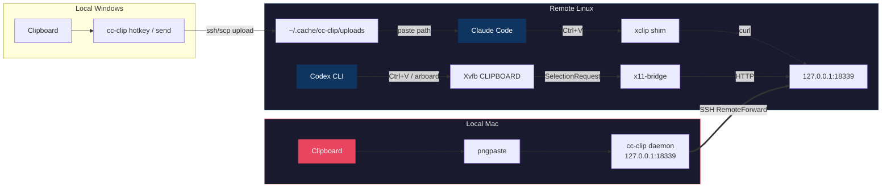

<p align="center">
  
</p>
<h1 align="center">cc-clip</h1>
<p align="center">
  <b>Paste images &amp; receive notifications across SSH — remote Claude Code &amp; Codex CLI feel local.</b>
</p>
<p align="center">
  <a href="https://github.com/fancy-potato/cc-clip/releases"></a>
  <a href="LICENSE"></a>
  <a href="https://go.dev"></a>
  <a href="https://github.com/fancy-potato/cc-clip/stargazers"></a>
</p>

<p align="center">
  
  <br>
  <em>Install → setup → paste. Clipboard works over SSH.</em>
</p>

---

<details>
<summary><b>Table of Contents</b></summary>

- [The Problem](#the-problem)
- [The Solution](#the-solution)
- [Prerequisites](#prerequisites)
- [Quick Start](#quick-start)
- [Why cc-clip?](#why-cc-clip)
- [How It Works](#how-it-works)
- [SSH Notifications](#ssh-notifications)
- [Security](#security)
- [Daily Usage](#daily-usage)
- [Persistent Tunnels & SwiftBar](#persistent-tunnels--swiftbar)
- [Commands](#commands)
- [Configuration](#configuration)
- [Platform Support](#platform-support)
- [Requirements](#requirements)
- [Troubleshooting](#troubleshooting)
- [Contributing](#contributing)
- [Related](#related)
- [License](#license)

</details>

---

## The Problem

When running Claude Code or Codex CLI on a remote server via SSH, **image paste often doesn't work** and **notifications don't reach you**. The remote clipboard is empty — no screenshots, no diagrams. And when Claude finishes a task or needs approval, you have no idea unless you're staring at the terminal.

## The Solution

```text
Image paste:
  Claude Code (macOS):   Mac clipboard     → cc-clip daemon → SSH tunnel → xclip shim      → Claude Code
  Claude Code (Windows): Windows clipboard → cc-clip hotkey → SSH/SCP    → remote file path → Claude Code
  Codex CLI:             Mac clipboard     → cc-clip daemon → SSH tunnel → x11-bridge/Xvfb → Codex CLI

Notifications:
  Claude Code hook → cc-clip-hook → SSH tunnel → local daemon → macOS/cmux notification
  Codex notify     → cc-clip notify             → SSH tunnel → local daemon → macOS/cmux notification
```

One tool. No changes to Claude Code or Codex. Clipboard and notifications both work over SSH.

## Prerequisites

- **Local machine:** macOS 13+ or Windows 10/11
- **Remote server:** Linux (amd64 or arm64) accessible via SSH
- **SSH config:** You must have an exact `Host <alias>` entry in `~/.ssh/config` for your remote server

If you don't have an SSH config entry yet, add one:

```
# ~/.ssh/config
Host myserver
    HostName 10.0.0.1       # your server's IP or domain
    User your-username
    IdentityFile ~/.ssh/id_rsa  # optional, if using key auth
```

Use a stable alias such as `myserver` for the config-managing commands (`cc-clip setup`, `cc-clip connect`, `cc-clip tunnel up`). Those commands manage or auto-detect the `cc-clip` SSH block by alias. `cc-clip doctor --host` is read-only, but using the same alias gives you the most useful SSH-config diagnostics.

`cc-clip` requires a dedicated exact `Host <alias>` stanza for the alias it manages. Shared multi-pattern stanzas such as `Host prod staging` are not supported; split them into separate `Host prod` / `Host staging` entries first.

If your SSH config also has broad stanzas such as `Host *` or `Host *.corp`, `cc-clip` is currently safe in these cases:

- `Host myserver` already exists as its own exact block, and it appears before wildcard stanzas that set `RemoteForward`, `ControlMaster`, or `ControlPath`
- Earlier wildcard stanzas do not set those three directives for this host path

`cc-clip` does **not** rewrite or reorder wildcard blocks for you. If an earlier wildcard stanza already wins for `RemoteForward`, `ControlMaster`, or `ControlPath`, move the exact `Host myserver` block above that wildcard stanza or remove the conflicting directive from the wildcard block.

If you are on Windows and want the SSH/Claude Code workflow, use the dedicated guide:

- [Windows Quick Start](docs/windows-quickstart.md)

## Quick Start

### Step 1: Install cc-clip

macOS / Linux:

```bash
curl -fsSL https://raw.githubusercontent.com/fancy-potato/cc-clip/main/scripts/install.sh | sh
```

Windows:

Follow the dedicated guide:

- [Windows Quick Start](docs/windows-quickstart.md)

On macOS / Linux, add `~/.local/bin` to your PATH if prompted:

```bash
# Add to your shell profile (~/.zshrc or ~/.bashrc)
export PATH="$HOME/.local/bin:$PATH"

# Reload your shell
source ~/.zshrc  # or: source ~/.bashrc
```

Verify the installation:

```bash
cc-clip --version
```

> **macOS "killed" error?** If you see `zsh: killed cc-clip`, macOS Gatekeeper is blocking the binary. Fix: `xattr -d com.apple.quarantine ~/.local/bin/cc-clip`

### Step 2: Setup (one command)

```bash
cc-clip setup myserver
```

This single command handles everything:
1. Installs local dependencies (`pngpaste`)
2. Updates your existing SSH host entry (`RemoteForward`, `ControlMaster no`, `ControlPath none`)
3. Starts the local daemon (via macOS launchd)
4. Deploys the binary and shim to the remote server

`cc-clip setup` edits the exact `Host myserver` block you pass in. It does not patch wildcard-only entries such as `Host *` or `Host *.corp`, it does not reorder earlier wildcard blocks, and it does not manage shared stanzas such as `Host prod staging`.

Before you run setup, make sure:
- You pass the SSH alias from `~/.ssh/config`, not `user@host`.
- The alias has its own exact `Host myserver` block.
- The alias is not grouped with another alias in a shared stanza such as `Host prod staging`.
- Earlier wildcard blocks do not already force conflicting `RemoteForward`, `ControlMaster`, or `ControlPath` values for that host, or your exact host block is placed before those wildcard blocks.
- `~/.ssh/config` is owned by your user, and if it is a symlink or reparse-point-backed path you understand that cc-clip rewrites the resolved target file in place.
- If `~/.ssh/config` uses `Include`, keep the exact host block you want cc-clip to manage in the main file. cc-clip does not rewrite included files.
- You are not editing `~/.ssh/config` in another editor while `cc-clip setup`, `cc-clip connect`, or `cc-clip uninstall --host` is running. Those commands do a read → rewrite → atomic rename without taking an advisory lock, so a concurrent `vim :w` can silently lose your edit. `cc-clip tunnel up` only reads the managed block to discover ports, and `cc-clip doctor` only checks and reports.

If `ssh -G myserver` still shows wildcard-derived `remoteforward`, `controlmaster`, or `controlpath` values after setup, manually reorder `~/.ssh/config` so the exact host block comes first, then re-run `cc-clip setup myserver`.

`cc-clip` creates a one-time `~/.ssh/config.cc-clip-backup` on the first rewrite and preserves it across subsequent runs. If you need to restore the pristine file, copy that backup over `~/.ssh/config` and re-run `cc-clip setup`.

### SSH config rewrite caveats

When `cc-clip` rewrites `~/.ssh/config`, it normalizes a few details that some hand-edited configs rely on. These are documented behaviors, not bugs — plan around them or keep the settings outside the exact host block cc-clip manages:

- **Line endings are picked by majority vote.** If your file's CRLF count strictly exceeds its LF count, cc-clip writes CRLF; otherwise it writes LF. A file with balanced or roughly-equal endings will come out all-LF.
- **Quoted `Host` tokens lose their quotes.** `Host "myserver"` is rewritten as `Host myserver`. The alias still works — ssh does not require quoting for simple tokens — but if you rely on the literal quotes they will not come back.
- **The managed marker strings are reserved.** Do not paste `# >>> cc-clip managed host: … >>>` anywhere in `~/.ssh/config` as free-form commentary; cc-clip treats that exact line as the start of a managed block.
- **`~/.ssh/config` is rewritten in place via tmp-file + rename.** Keep the file on the same filesystem as its parent directory (default on every platform unless you've symlinked the whole `~/.ssh` tree across volumes).

<details>
<summary>See it in action (macOS)</summary>
<p align="center">
  
</p>
</details>

<details>
<summary>Also use Codex CLI? Add <code>--codex</code></summary>

```bash
cc-clip setup myserver --codex
```

This additionally installs Xvfb and the x11-bridge on the remote. If `Xvfb` is not found and auto-install fails, you'll see the exact command to run:

```bash
ssh myserver
sudo apt install xvfb          # Debian/Ubuntu
sudo dnf install xorg-x11-server-Xvfb   # RHEL/Fedora
```

Then re-run `cc-clip setup myserver --codex`.

</details>

<details>
<summary>Windows? Use the dedicated guide</summary>

- [Windows Quick Start](docs/windows-quickstart.md)

<p align="center">
  
</p>

</details>

### Step 3: Connect and use

Use one of these workflows:

```bash
# Default per-session tunnel — the reverse forward comes up with your SSH session.
ssh myserver

# Optional persistent tunnel — the daemon owns the forward, open SSH sessions
# independently of the tunnel lifecycle.
cc-clip tunnel up myserver
ssh myserver    # still how you get a shell; the forward is already alive
```

Then use Claude Code or Codex CLI as normal — `Ctrl+V` now pastes images from your Mac clipboard.

> **Important:** The image paste works through the SSH tunnel. You must connect via `ssh myserver` (the host you set up). Without a persistent tunnel, the forward comes up with each SSH session. With `cc-clip tunnel up myserver`, the daemon keeps the forward alive in the background.
>
> If `which xclip` still points to `/usr/bin/xclip` or `DISPLAY` is still empty after reconnecting, your login shell may not source `~/.bashrc` or `~/.zshrc` automatically. Run `source ~/.bashrc` or `source ~/.zshrc`, then see [Troubleshooting Guide](docs/troubleshooting.md) for a persistent fix.
>
> If your usual habit is `ssh alice@example.com`, create an alias such as `Host myserver` in `~/.ssh/config` and use `ssh myserver` for both setup and daily use with `cc-clip`.

### Verify it works

```bash
# Copy an image to your Mac clipboard first (Cmd+Shift+Ctrl+4), then:
cc-clip doctor --host myserver
```

On Windows, the equivalent quick check is:

- [Windows Quick Start](docs/windows-quickstart.md)

## Why cc-clip?

| Approach | Works over SSH? | Any terminal? | Image support? | Setup complexity |
|----------|:-:|:-:|:-:|:--:|
| Native Ctrl+V | Local only | Some | Yes | None |
| X11 Forwarding | Yes (slow) | N/A | Yes | Complex |
| OSC 52 clipboard | Partial | Some | Text only | None |
| **cc-clip** | **Yes** | **Yes** | **Yes** | **One command** |

## How It Works



1. **macOS Claude path:** the local daemon reads your Mac clipboard via `pngpaste`, serves images over HTTP on loopback, and the remote `xclip` shim fetches images through the SSH tunnel
2. **Windows Claude path:** the local hotkey reads your Windows clipboard, uploads the image over SSH/SCP, and pastes the remote file path into the active terminal
3. **Codex CLI path:** x11-bridge claims CLIPBOARD ownership on a headless Xvfb, serves images on-demand when Codex reads the clipboard via X11
4. **Notification path:** remote Claude Code hooks and Codex notify pipe events through `cc-clip-hook` → SSH tunnel → local daemon → macOS Notification Center or cmux

## SSH Notifications

When Claude Code or Codex CLI runs on a remote server, **notifications don't work over SSH** — `TERM_PROGRAM` isn't forwarded, hooks execute on the remote where `terminal-notifier` doesn't exist, and tmux swallows OSC sequences.

cc-clip solves this by acting as a **notification transport bridge**: remote hook events travel through the same SSH tunnel used for clipboard, and the local daemon delivers them to your macOS notification system (or cmux if installed).

### What you'll see

| Event | Notification | Example |
|-------|-------------|---------|
| Claude finishes responding | "Claude stopped" + last message preview | `Claude stopped: I've implemented the notification bridge...` |
| Claude needs tool approval | "Tool approval needed" + tool name | `Tool approval needed: Claude wants to Edit cmd/main.go` |
| Codex task completes | "Codex" + completion message | `Codex: Added error handling to fetch module` |
| Image pasted via Ctrl+V | "cc-clip #N" + fingerprint + dimensions | `cc-clip #3: a1b2c3d4 . 1920x1080 . PNG` |
| Duplicate image detected | Same as above + duplicate marker | `cc-clip #4: Duplicate of #2` |

Image paste notifications help you track what was pasted without leaving your workflow:
- **Sequence number** (#1, #2, #3...) lets you detect gaps (e.g., #1 → #3 means #2 was lost)
- **Duplicate detection** alerts when the same image is pasted twice within 5 images
- **Click notification** to open the full image in Preview.app (macOS, requires `terminal-notifier`)

### Setup notifications

**Step 1:** Make sure `cc-clip serve` is running locally (or use `cc-clip service install` for auto-start).

**Step 2:** Configure your remote Claude Code hooks. The easiest way is to **ask Claude Code itself to do it**. SSH into your server, start Claude Code, and paste this prompt:

```
Please add cc-clip-hook to my Claude Code hooks configuration. Add it to both Stop and Notification hooks in ~/.claude/settings.json. The command is just "cc-clip-hook" (it's already in PATH at ~/.local/bin/). Keep any existing hooks (like ralph-wiggum) — just append cc-clip-hook alongside them. Show me the diff before and after.
```

Claude Code will read your current `settings.json`, add the hooks correctly, and show you the changes.

Alternatively, you can configure manually:

<details>
<summary>Manual hook configuration</summary>

Edit `~/.claude/settings.json` on the **remote server** and add `cc-clip-hook` to the `Stop` and `Notification` hook arrays:

```json
{
  "hooks": {
    "Stop": [
      {
        "hooks": [
          { "type": "command", "command": "cc-clip-hook" }
        ]
      }
    ],
    "Notification": [
      {
        "hooks": [
          { "type": "command", "command": "cc-clip-hook" }
        ]
      }
    ]
  }
}
```

If you already have hooks (e.g., `ralph-wiggum-stop.sh`), add a new entry to the array — don't replace existing ones.

**Restart Claude Code** after editing (hooks are read at startup).

</details>

**Step 3 (Codex only):** Codex notification is auto-configured by `cc-clip connect` if `~/.codex/` exists on the remote. No manual steps needed.

**Step 4:** Generate and register a notification nonce (if you haven't used `cc-clip connect`):

```bash
# On local Mac — generate nonce and write to remote
NONCE=$(openssl rand -hex 32)
curl -s -X POST -H "Authorization: Bearer $(head -1 ~/.cache/cc-clip/session.token)" \
  -H "User-Agent: cc-clip/0.1" -H "Content-Type: application/json" \
  -d "{\"nonce\":\"$NONCE\"}" http://127.0.0.1:18339/register-nonce
ssh myserver "mkdir -p ~/.cache/cc-clip && echo '$NONCE' > ~/.cache/cc-clip/notify.nonce && chmod 600 ~/.cache/cc-clip/notify.nonce"
```

> **Note:** `cc-clip connect` handles steps 2-4 automatically. Manual setup is only needed if you use plain `ssh` instead of `cc-clip connect`.

### Troubleshooting notifications

<details>
<summary><b>Notifications don't appear</b></summary>

**Step-by-step verification (on the remote server):**

```bash
# 1. Is the tunnel working?
curl -sf --connect-timeout 2 http://127.0.0.1:18339/health
# Expected: {"status":"ok"}

# 2. Is the hook script the correct version?
grep "curl" ~/.local/bin/cc-clip-hook
# Expected: a curl command with --connect-timeout

# 3. Is the nonce file present?
cat ~/.cache/cc-clip/notify.nonce
# Expected: a 64-character hex string

# 4. Manual test:
echo '{"hook_event_name":"Stop","stop_hook_reason":"stop_at_end_of_turn","last_assistant_message":"test"}' | cc-clip-hook
# Expected: local Mac shows notification popup

# 5. Check health log for failures:
cat ~/.cache/cc-clip/notify-health.log
# If exists: shows timestamps and HTTP error codes
```

**Common issues:**

| Problem | Fix |
|---------|-----|
| Tunnel down (step 1 fails) | Kill the stale sshd that holds the managed remote port: find it with `ssh -G myserver \| awk '$1 == "remoteforward" {print $2; exit}'`, then inspect/kill that port on remote and reconnect SSH |
| Old hook script (step 2 empty) | Reinstall: `cc-clip connect myserver` or manually copy the script |
| Missing nonce (step 3 fails) | Register nonce (see Step 4 above) |
| Daemon running old binary | Rebuild (`make build`) and restart (`cc-clip serve`) |

</details>

## Security

| Layer | Protection |
|-------|-----------|
| Network | Loopback only (`127.0.0.1`) — never exposed |
| Clipboard auth | Bearer token with 30-day sliding expiration (auto-renews on use) |
| Notification auth | Dedicated nonce per-connect session (separate from clipboard token) |
| Token delivery | Via stdin, never in command-line args |
| Notification trust | Hook notifications marked `verified`; generic JSON shows `[unverified]` prefix |
| Transparency | Non-image calls pass through to real `xclip` unchanged |

## Daily Usage

After initial setup, your daily workflow is:

```bash
# 1. SSH to your server (tunnel activates automatically)
ssh myserver

# 2. Use Claude Code or Codex CLI normally
claude          # Claude Code
codex           # Codex CLI

# 3. Ctrl+V pastes images from your Mac clipboard
```

On macOS, the local daemon runs as a launchd service and starts automatically on login — no need to re-run setup. On Linux, there is no bundled auto-start integration; either run `cc-clip serve` manually in a terminal multiplexer, or wire it up with systemd/supervisord as you prefer.

### Windows workflow

On Windows, some `Windows Terminal -> SSH -> tmux -> Claude Code` combinations do not trigger the remote `xclip` path when you press `Alt+V` or `Ctrl+V`. `cc-clip` therefore provides a Windows-native workflow that does not depend on remote clipboard interception.

For first-time setup and day-to-day usage, use:

- [Windows Quick Start](docs/windows-quickstart.md)

The Windows workflow uses a dedicated remote-paste hotkey (default: `Alt+Shift+V`) so it does not collide with local Claude Code's native `Alt+V`.

## Persistent Tunnels & SwiftBar

By default the SSH tunnel only lives while your `ssh myserver` session is open. **Persistent tunnels** keep the port forwarding alive in the background with auto-reconnect, so clipboard and notifications work even when you don't have an interactive SSH session.

### Managing persistent tunnels (CLI)

```bash
# Start a persistent tunnel for a host
cc-clip tunnel up myserver

# List all tunnels and their status
cc-clip tunnel list

# Stop the tunnel on the current daemon (default port 18339).
# For multi-daemon setups, pass --port (or CC_CLIP_PORT) to select another daemon.
cc-clip tunnel down myserver

# Forget a tunnel entirely (stops it, then deletes its saved state file)
cc-clip tunnel remove myserver
```

`tunnel up` auto-detects the remote listen port from your `~/.ssh/config` managed block. Tunnels survive daemon restarts — the daemon re-establishes saved tunnels on startup.

**Picking up `~/.ssh/config` changes.** When you first run `cc-clip tunnel up <host>`, cc-clip runs `ssh -G <host>` to expand your SSH config (HostName, User, IdentityFile, ProxyCommand, …) and caches the result in the tunnel's state file. The reconnect loop and daemon-startup adoption re-use that cached snapshot; they do **not** re-read `~/.ssh/config` on every reconnect. This is deliberate: it keeps the options you approved at `tunnel up` time from being silently replaced on the next network flap. If you later edit `~/.ssh/config` (e.g. you updated `HostName`, rotated an `IdentityFile`, or added a `ProxyCommand`), re-run `cc-clip tunnel up <host>` to refresh the cache — that is the canonical "tell cc-clip about my new SSH config" command. Editing the config alone is not enough; `tunnel down && tunnel up` also works but `tunnel up` is sufficient.

Port source model:

- `cc-clip connect` reserves the remote listen port in the remote peer registry, then writes that reservation into the local managed `RemoteForward` block.
- The allocation source of truth is the remote peer registry.
- The runtime source used by `cc-clip tunnel up` is the local managed block in `~/.ssh/config`. `tunnel up` does not SSH back to the remote just to look up the port.
- `cc-clip doctor --host` compares the remote peer registry with the local managed block, then checks the effective SSH config from `ssh -G`.

Daemon/port model:

- The local daemon port defaults to `18339`. Override per-command with `--port`, or globally with `CC_CLIP_PORT`.
- A persistent tunnel's `local_port` (the endpoint of `ssh -R <remote>:127.0.0.1:<local_port>`) is always equal to the owning daemon's HTTP port — the reverse forward is only useful if it lands on a port where a daemon is actually listening. A daemon only manages tunnels whose `local_port` matches its own listening port.
- `tunnel up` / `down` / `remove` accept a single `--port` flag that selects the daemon to talk to. `tunnel up` will also adopt the daemon port recorded in the managed block (or the only saved tunnel for the host) when `--port` is not given, so `cc-clip tunnel up <host>` routes to the right daemon automatically in single-daemon setups.
- To act on a specific daemon's tunnel in a multi-daemon setup, point `--port` (or `CC_CLIP_PORT`) at that daemon.

> **Requirement:** Persistent tunnels use `BatchMode=yes` (no interactive prompts). Your SSH key must be in `ssh-agent` or passwordless. Run `ssh-add` if needed.
>
> If you upgraded from an older `cc-clip` while the local daemon was already running, restart the local daemon/service once before using `cc-clip tunnel ...` so the `/tunnels` routes are registered.
>
> **Token rotation:** The tunnel-control token at `~/.cache/cc-clip/tunnel-control.token` is local-only (never synced to the remote). Rotate it with `cc-clip serve --rotate-tunnel-token`; the SwiftBar plugin and `cc-clip tunnel ...` CLI read the fresh token on next invocation.

### SwiftBar menu bar plugin (macOS)

[SwiftBar](https://github.com/swiftbar/SwiftBar) is a macOS menu bar app that runs shell scripts and displays their output. The included plugin shows tunnel status at a glance and lets you start/stop already-saved tunnels from the menu bar.

<p align="center">
  <code>● 2/3</code> — 2 of 3 tunnels connected
</p>

**Prerequisites:**

- [SwiftBar](https://github.com/swiftbar/SwiftBar) installed (`brew install --cask swiftbar`)
- `jq` installed (`brew install jq`)
- `cc-clip` in PATH

**Install the plugin:**

Symlink the script into SwiftBar's plugin directory. Use an absolute path so
the link keeps working when you move your shell elsewhere:

```bash
ln -s /absolute/path/to/cc-clip/scripts/cc-clip-tunnels.30s.sh \
    ~/Library/Application\ Support/SwiftBar/Plugins/
```

If you are currently `cd`'d into the repo root, `$(pwd)/scripts/...` expands
to the same absolute path.

The `30s` in the filename means SwiftBar refreshes every 30 seconds.

Create the first tunnel from the CLI with `cc-clip tunnel up myserver`. After that, SwiftBar can manage the saved tunnel.

If you keep multiple daemon instances on different ports for the same host, select which one to act against with `--port` (or `CC_CLIP_PORT`):

```bash
cc-clip tunnel down myserver --port 18444
# or
CC_CLIP_PORT=18444 cc-clip tunnel down myserver
```

See the [Daemon/port model](#managing-persistent-tunnels-cli) above for why `--port` is the only selector needed.

**What you'll see:**

| Menu bar | Meaning |
|----------|---------|
| `● 2/2` (green) | All tunnels connected |
| `● 1/2` (orange) | Some tunnels disconnected |
| `⊘ 0/2` (gray) | All tunnels down |
| `⊘` | No tunnels configured |

Click the menu bar icon to see per-host details:

- Status (connected / connecting / disconnected)
- Port mapping (remote:port -> local:port)
- PID, reconnect count, last error
- **Start** / **Stop** button for each tunnel, sent to that tunnel's recorded local daemon port

## Commands

| Command | Description |
|---------|-------------|
| `cc-clip setup <host>` | **Full setup**: deps, SSH config, daemon, deploy |
| `cc-clip setup <host> --codex` | Full setup with Codex CLI support |
| `cc-clip connect <host>` | Deploy to remote (incremental) |
| `cc-clip connect <host> --token-only` | Sync token only (fast) |
| `cc-clip connect <host> --force` | Full redeploy ignoring cache |
| `cc-clip tunnel list` | List persistent tunnels and their status |
| `cc-clip tunnel up <host>` | Start a persistent tunnel to a host |
| `cc-clip tunnel down <host>` | Stop a persistent tunnel owned by this daemon (select with `--port` / `CC_CLIP_PORT` if you run several) |
| `cc-clip tunnel remove <host>` | Stop and delete a persistent tunnel's saved state (select daemon with `--port`) |
| `cc-clip notify --title T --body B` | Send a notification through the tunnel |
| `cc-clip notify --from-codex-stdin` | Read Codex JSON from stdin and notify |
| `cc-clip doctor --host <host>` | End-to-end health check |
| `cc-clip status` | Show local component status |
| `cc-clip service install` | Install macOS launchd service |
| `cc-clip service uninstall` | Remove launchd service |
| `cc-clip send [<host>] --paste` | Windows: upload clipboard image and paste remote path |
| `cc-clip hotkey [<host>]` | Windows: register the remote upload/paste hotkey |
| `cc-clip install --target <target>` | Install a local `xclip` or `wl-paste` shim |
| `cc-clip uninstall --target <target>` | Remove a local shim; `auto` works when exactly one cc-clip shim is installed |

<details>
<summary>All commands</summary>

| Command | Description |
|---------|-------------|
| `cc-clip setup <host>` | Full setup: deps, SSH config, daemon, deploy |
| `cc-clip setup <host> --codex` | Full setup including Codex CLI support |
| `cc-clip connect <host>` | Deploy to remote (incremental) |
| `cc-clip connect <host> --codex` | Deploy with Codex support (Xvfb + x11-bridge) |
| `cc-clip connect <host> --token-only` | Sync token only (fast) |
| `cc-clip connect <host> --force` | Full redeploy ignoring cache |
| `cc-clip tunnel list [--json]` | List persistent tunnels |
| `cc-clip tunnel up <host> [--remote-port N]` | Start a persistent tunnel |
| `cc-clip tunnel down <host>` | Stop the tunnel owned by the current daemon (select with `--port` / `CC_CLIP_PORT`) |
| `cc-clip tunnel remove <host>` | Stop and delete the tunnel's saved state (select daemon with `--port`) |
| `cc-clip serve` | Start daemon in foreground |
| `cc-clip serve --rotate-token` | Start daemon with forced new clipboard session token |
| `cc-clip serve --rotate-tunnel-token` | Start daemon with forced new tunnel-control token |
| `cc-clip service install` | Install macOS launchd service |
| `cc-clip service uninstall` | Remove launchd service |
| `cc-clip service status` | Show service status |
| `cc-clip send [<host>]` | Upload clipboard image to a remote file |
| `cc-clip send [<host>] --paste` | Windows: paste the uploaded remote path into the active window |
| `cc-clip hotkey [<host>]` | Windows: run a background remote-paste hotkey listener |
| `cc-clip hotkey --enable-autostart` | Windows: start the hotkey listener automatically at login |
| `cc-clip hotkey --disable-autostart` | Windows: remove hotkey auto-start at login |
| `cc-clip hotkey --status` | Windows: show hotkey status |
| `cc-clip hotkey --stop` | Windows: stop the hotkey listener |
| `cc-clip notify --title T --body B` | Send a generic notification through the tunnel |
| `cc-clip notify --from-codex "$1"` | Parse Codex JSON arg and notify |
| `cc-clip notify --from-codex-stdin` | Read Codex JSON from stdin and notify |
| `cc-clip doctor` | Local health check |
| `cc-clip doctor --host <host>` | End-to-end health check |
| `cc-clip status` | Show component status |
| `cc-clip install --target <target>` | Install a local `xclip` or `wl-paste` shim |
| `cc-clip uninstall` | Remove a local shim; `auto` removes the installed shim when exactly one exists |
| `cc-clip uninstall --target <target>` | Remove the specified local shim explicitly |
| `cc-clip uninstall --host <host>` | Remove the managed PATH marker from the remote host |
| `cc-clip uninstall --codex` | Remove Codex support (local) |
| `cc-clip uninstall --codex --host <host>` | Remove Codex support from remote |

</details>

## Configuration

All settings have sensible defaults. The local daemon port defaults to `18339`. Override it with `CC_CLIP_PORT`, or with command-specific `--port` flags where supported:

| Setting | Default | Env Var |
|---------|---------|---------|
| Local daemon port | 18339 | `CC_CLIP_PORT` |
| Token TTL | 30d | `CC_CLIP_TOKEN_TTL` |
| Debug logs | off | `CC_CLIP_DEBUG=1` |

<details>
<summary>All settings</summary>

| Setting | Default | Env Var |
|---------|---------|---------|
| Local daemon port | 18339 | `CC_CLIP_PORT` |
| Token TTL | 30d | `CC_CLIP_TOKEN_TTL` |
| Output dir | `$XDG_RUNTIME_DIR/claude-images` | `CC_CLIP_OUT_DIR` |
| Probe timeout | 500ms | `CC_CLIP_PROBE_TIMEOUT_MS` |
| Fetch timeout | 5000ms | `CC_CLIP_FETCH_TIMEOUT_MS` |
| Debug logs | off | `CC_CLIP_DEBUG=1` |

</details>

## Platform Support

| Local | Remote | Status |
|-------|--------|--------|
| macOS (Apple Silicon) | Linux (amd64) | Stable |
| macOS (Intel) | Linux (arm64) | Stable |
| Windows 10/11 | Linux (amd64/arm64) | Experimental (`send` / `hotkey`) |

## Requirements

**Local (macOS):** macOS 13+ (`pngpaste`, auto-installed by `cc-clip setup`)

**Local (Windows):** Windows 10/11 with PowerShell, `ssh`, and `scp` available in `PATH`

**Remote:** Linux with `xclip`, `curl`, `bash`, and SSH access. The macOS tunnel/shim path is auto-configured by `cc-clip connect`; the Windows upload/hotkey path uses SSH/SCP directly.

**Remote (Codex `--codex`):** Additionally requires `Xvfb`. Auto-installed if passwordless sudo is available, otherwise: `sudo apt install xvfb` (Debian/Ubuntu) or `sudo dnf install xorg-x11-server-Xvfb` (RHEL/Fedora).

## Troubleshooting

```bash
# One command to check everything
cc-clip doctor --host myserver
```

<details>
<summary><b>"zsh: killed" after installation</b></summary>

**Symptom:** Running any `cc-clip` command immediately shows `zsh: killed cc-clip ...`

**Cause:** macOS Gatekeeper blocks unsigned binaries downloaded from the internet.

**Fix:**

```bash
xattr -d com.apple.quarantine ~/.local/bin/cc-clip
```

Or reinstall (the latest install script handles this automatically):

```bash
curl -fsSL https://raw.githubusercontent.com/fancy-potato/cc-clip/main/scripts/install.sh | sh
```

</details>

<details>
<summary><b>"cc-clip: command not found"</b></summary>

**Cause:** `~/.local/bin` is not in your PATH.

**Fix:**

```bash
# Add to your shell profile
echo 'export PATH="$HOME/.local/bin:$PATH"' >> ~/.zshrc
source ~/.zshrc
```

Replace `~/.zshrc` with `~/.bashrc` if you use bash.

</details>

<details>
<summary><b>Ctrl+V doesn't paste images (Claude Code)</b></summary>

**Step-by-step verification:**

```bash
# Replace <local-daemon-port> with your current local daemon port
# (default 18339, or your CC_CLIP_PORT / --port value).

# 1. Local: Is the daemon running?
curl -s http://127.0.0.1:<local-daemon-port>/health
# Expected: {"status":"ok"}

# 2. Remote: Is the tunnel forwarding?
# Replace <remote-port> with the managed RemoteForward listen port.
ssh myserver "curl -s http://127.0.0.1:<remote-port>/health"
# Expected: {"status":"ok"}

# 3. Remote: Is the shim taking priority?
ssh myserver "which xclip"
# Expected: ~/.local/bin/xclip  (NOT /usr/bin/xclip)

# 4. Remote: Does the shim intercept correctly?
# (copy an image to Mac clipboard first)
ssh myserver 'CC_CLIP_DEBUG=1 xclip -selection clipboard -t TARGETS -o'
# Expected: image/png
```

If step 2 fails, either start the persistent tunnel locally with `cc-clip tunnel up myserver`, or open a **new** SSH connection if you are using the per-session tunnel flow.

If step 3 fails, the PATH fix didn't take effect. Open a fresh SSH session, or run `source ~/.bashrc` / `source ~/.zshrc`. See [Troubleshooting Guide](docs/troubleshooting.md) if your login shell does not load that file automatically.

</details>

<details>
<summary><b>New SSH tab says "remote port forwarding failed for listen port ..."</b></summary>

**Symptom:** A newly opened SSH tab warns `remote port forwarding failed for listen port <remote-port>`.

**Cause:** `cc-clip tunnel up myserver` does not hardcode a remote port. It reads the alias's managed `RemoteForward` and reuses that remote listen port. If another SSH session to the same host already owns that port, or a stale `sshd` child is still holding it, the new tab cannot establish its own tunnel. If you are using `cc-clip tunnel up myserver`, that persistent tunnel already owns the port on purpose, so the warning on extra SSH tabs is expected.

**Fix:**

```bash
# Show the managed RemoteForward mapping for this alias:
ssh -G myserver | awk '$1 == "remoteforward" {print $2, $3; exit}'

# Then inspect that remote listen port without opening another forward:
ssh -o ClearAllForwardings=yes myserver "ss -tln | grep <remote-port> || true"
```

- If `cc-clip tunnel list` shows a connected persistent tunnel for this host, you can ignore the warning. Clipboard and notifications continue to use the already-running persistent tunnel.
- If you are not using persistent tunnels, another live SSH tab may already own the port. Use that tab/session, or close it before opening a new one.
- If the port is stuck after a disconnect and no persistent tunnel is connected, follow the stale `sshd` cleanup steps below.
- If you truly need multiple concurrent SSH sessions with image paste, give each host alias a different managed `RemoteForward` port instead of sharing the same one.

</details>

<details>
<summary><b>Ctrl+V doesn't paste images (Codex CLI)</b></summary>

> **Most common cause:** DISPLAY environment variable is empty. You must open a **new** SSH session after setup — existing sessions don't pick up the updated shell rc file.

**Step-by-step verification (run these on the remote server):**

```bash
# 1. Is DISPLAY set?
echo $DISPLAY
# Expected: 127.0.0.1:0 (or 127.0.0.1:1, etc.)
# If empty → open a NEW SSH session, or run: source ~/.bashrc / source ~/.zshrc

# 2. Is the SSH tunnel working?
# Replace <remote-port> with the managed RemoteForward listen port.
curl -s http://127.0.0.1:<remote-port>/health
# Expected: {"status":"ok"}
# If fails → if you use persistent tunnels, run `cc-clip tunnel list` locally and restart it with
# `cc-clip tunnel up myserver`; otherwise open a NEW SSH connection

# 3. Is Xvfb running?
ps aux | grep Xvfb | grep -v grep
# Expected: a Xvfb process
# If missing → re-run: cc-clip connect myserver --codex --force

# 4. Is x11-bridge running?
ps aux | grep 'cc-clip x11-bridge' | grep -v grep
# Expected: a cc-clip x11-bridge process
# If missing → re-run: cc-clip connect myserver --codex --force

# 5. Does the X11 socket exist?
ls -la /tmp/.X11-unix/
# Expected: X0 file (matching your display number)

# 6. Can xclip read clipboard via X11? (copy an image on Mac first)
xclip -selection clipboard -t TARGETS -o
# Expected: image/png
```

**Common fixes:**

| Step fails | Fix |
|-----------|-----|
| Step 1 (DISPLAY empty) | Open a **new** SSH session. If still empty: `source ~/.bashrc` or `source ~/.zshrc` |
| Step 2 (tunnel down) | If you use persistent tunnels, run `cc-clip tunnel list` locally and restart it with `cc-clip tunnel up myserver`; otherwise open a **new** SSH connection |
| Steps 3-4 (processes missing) | `cc-clip connect myserver --codex --force` from local |
| Step 6 (no image/png) | Copy an image on Mac first: `Cmd+Shift+Ctrl+4` |

> **Note:** DISPLAY uses TCP loopback format (`127.0.0.1:N`) instead of Unix socket format (`:N`) because Codex CLI's sandbox blocks access to `/tmp/.X11-unix/`. If you previously set up cc-clip with an older version, re-run `cc-clip connect myserver --codex --force` to update.

</details>

<details>
<summary><b>Fresh SSH session still misses PATH or DISPLAY</b></summary>

**Symptom:** You reconnect with `ssh myserver`, but `which xclip` still resolves to `/usr/bin/xclip`, or `echo $DISPLAY` is still empty.

**Cause:** `cc-clip` writes its PATH and DISPLAY markers into `~/.bashrc` or `~/.zshrc`. Some login-shell setups do not source those files automatically on SSH login.

**Quick fix for the current shell:**

```bash
source ~/.bashrc
# or
source ~/.zshrc
```

**Persistent fix for bash login shells:**

```bash
printf '\n[ -f ~/.bashrc ] && . ~/.bashrc\n' >> ~/.bash_profile
```

If your system uses `~/.profile` instead of `~/.bash_profile`, add the same line there. Then open a new SSH session and re-check `which xclip` or `echo $DISPLAY`.

</details>

<details>
<summary><b>SSH ControlMaster breaks RemoteForward</b></summary>

**Symptom:** Tunnel works during `connect`, but `curl http://127.0.0.1:<remote-port>/health` hangs in your SSH session.

**Cause:** An existing SSH ControlMaster connection was reused without `RemoteForward`.

**Fix:** `cc-clip setup` auto-configures this. If you set up SSH manually, add to `~/.ssh/config`:

```
Host myserver
    ControlMaster no
    ControlPath none
```

</details>

<details>
<summary><b>Setup fails because you passed <code>user@host</code> instead of a Host alias</b></summary>

**Symptom:** `cc-clip setup alice@example.com` or `cc-clip connect alice@example.com` fails to update SSH config, or `doctor --host` reports that the exact host block is missing.

**Cause:** `cc-clip` updates an exact `Host <alias>` block in `~/.ssh/config`. It does not manage raw `user@host` destinations directly.

**Fix:** Define an alias first, then use that alias everywhere:

```sshconfig
Host myserver
    HostName example.com
    User alice
```

Then run:

```bash
cc-clip setup myserver
ssh myserver
```

</details>

<details>
<summary><b>Setup fails because the alias lives in a shared <code>Host prod staging</code> stanza</b></summary>

**Symptom:** `cc-clip setup staging`, `cc-clip connect staging`, or `cc-clip tunnel up staging` fails even though `staging` appears in `~/.ssh/config`.

**Cause:** `cc-clip` only manages a dedicated exact `Host <alias>` block. Shared multi-pattern stanzas such as `Host prod staging` are unsupported.

**Fix:** Split the shared stanza into separate exact aliases before using `cc-clip`:

```sshconfig
Host prod
    HostName prod.example.com
    User alice

Host staging
    HostName staging.example.com
    User alice
```

Then run `cc-clip setup staging` (or the alias you want to manage).

</details>

<details>
<summary><b>Earlier <code>Host *</code> or wildcard stanzas override the managed host</b></summary>

**Symptom:** `cc-clip setup myserver` succeeds, but the SSH session still behaves as if your global SSH defaults won. Common signs are the tunnel not appearing, or `ssh -G myserver` showing unexpected `ControlMaster`, `ControlPath`, or `RemoteForward` values.

**Cause:** OpenSSH uses the first value it obtains for most settings. An earlier `Host *` or `Host *.corp` stanza can override the exact host before `cc-clip`'s managed settings are reached.

**What works today:**

- A dedicated exact block such as `Host myserver`
- Wildcard stanzas that appear later in the file
- Earlier wildcard stanzas that do not set `RemoteForward`, `ControlMaster`, or `ControlPath`

**What needs manual cleanup:**

- A wildcard-only config with no exact `Host myserver` block
- An earlier `Host *` / `Host *.corp` stanza that already sets `RemoteForward`, `ControlMaster`, or `ControlPath`
- A config where `cc-clip` updated `Host myserver`, but that exact block still appears after the conflicting wildcard stanza

**Fix:** Keep your exact host entry and move conflicting wildcard settings after it, or remove the conflicting directives for that host path. `cc-clip` does not reorder wildcard blocks for you. A safe structure looks like:

```sshconfig
Host myserver
    HostName example.com
    User alice
    # cc-clip-managed directives land here

Host *
    ServerAliveInterval 30
```

If you keep a wildcard block for general SSH defaults, prefer leaving only non-conflicting options there. After editing the file, re-run:

```bash
cc-clip setup myserver
ssh -G myserver | grep -E '^(hostname|user|remoteforward|controlmaster|controlpath) '
```

If you need to inspect the effective config, run:

```bash
ssh -G myserver | grep -E '^(hostname|user|remoteforward|controlmaster|controlpath) '
```

</details>

<details>
<summary><b>Stale sshd process blocks the managed remote port</b></summary>

**Symptom:** `Warning: remote port forwarding failed for listen port <remote-port>`, and `cc-clip tunnel list` does not show a connected persistent tunnel for that host.

**Fix:** Kill the stale process on remote only after confirming no persistent tunnel is already connected:

```bash
sudo ss -tlnp | grep <remote-port>     # find the PID
sudo kill <PID>                  # kill it
```

Then reconnect: `ssh myserver`

</details>

<details>
<summary><b>Token expired after 30+ days of inactivity</b></summary>

**Fix:** `cc-clip connect myserver --token-only`

Token uses sliding expiration — auto-renews on every use. Only expires after 30 days of zero activity.

</details>

<details>
<summary><b>Launchd daemon can't find pngpaste</b></summary>

**Fix:** `cc-clip service uninstall && cc-clip service install` (regenerates plist with correct PATH).

</details>

<details>
<summary><b>Setup fails: "killed" during re-deployment</b></summary>

**Symptom:** `cc-clip setup` was working before, but now shows `zsh: killed` when re-running.

**Cause:** The launchd service is running the old binary. Replacing the binary while the daemon holds it open can cause conflicts.

**Fix:**

```bash
cc-clip service uninstall
curl -fsSL https://raw.githubusercontent.com/fancy-potato/cc-clip/main/scripts/install.sh | sh
cc-clip setup myserver
```

</details>

<details>
<summary><b>My manual edit to <code>~/.ssh/config</code> disappeared after running cc-clip</b></summary>

**Symptom:** You edited `~/.ssh/config` in an editor, saved, and a config-writing `cc-clip` command such as `setup`, `connect`, or `uninstall --host` that was running in parallel finished without error — but your edit is gone.

**Cause:** `cc-clip` reads `~/.ssh/config`, builds the new contents in memory, writes a temp file, and `rename`s it over the original. It does not take an advisory file lock around that read-modify-write cycle. If your editor's save lands between cc-clip's read and rename, your change is on the version that gets overwritten.

**Fix:** Restore from your own backup, or from `~/.ssh/config.cc-clip-backup` if that sidecar holds a version you can work from. Going forward, do not run config-writing cc-clip commands while an editor has `~/.ssh/config` open with unsaved changes. This is an explicit product boundary — cc-clip assumes a single user is the sole editor of `~/.ssh/config`.

</details>

<details>
<summary><b>cc-clip reformatted my <code>~/.ssh/config</code> line endings</b></summary>

**Symptom:** Your file used mixed CRLF/LF line endings before, and now every line uses the same ending.

**Cause:** `cc-clip` picks one dominant line ending per rewrite. CRLF is used only if its count strictly exceeds LF; otherwise the file is written in LF. Balanced or mixed files collapse to LF.

**Fix:** If you need CRLF, ensure your existing file is already majority-CRLF before cc-clip runs (most Windows editors default to CRLF, which preserves the format). There is no flag to force a specific ending.

</details>

<details>
<summary><b>My <code>Host "alias"</code> lost its quotes after cc-clip ran</b></summary>

**Symptom:** You wrote `Host "myserver"` in `~/.ssh/config`; after `cc-clip setup` it reads `Host myserver`.

**Cause:** `cc-clip` strips surrounding quotes from `Host` tokens when parsing and writes them back without quoting. The alias still works — ssh does not require quoting for simple tokens — but if anything downstream relies on the literal quoted form, it will break.

**Fix:** Keep the alias unquoted, or keep the quoted form in an entry cc-clip does not manage.

</details>

<details>
<summary><b>The managed host lives behind an <code>Include</code> and does not get updated</b></summary>

**Symptom:** `~/.ssh/config` contains `Include ...`, and the `Host myserver` stanza you expect `cc-clip` to manage lives only in one of those included files. `cc-clip setup` or `cc-clip connect` succeeds, but the included file is unchanged.

**Cause:** `cc-clip` only rewrites the main `~/.ssh/config` file. It tolerates `Include` directives, but it does not chase them and mutate included files on your behalf.

**Fix:** Keep the exact `Host myserver` block in the main `~/.ssh/config` when you want automatic management, or manage the included file yourself.

</details>

<details>
<summary><b>Symlinked <code>~/.ssh/config</code> and Windows junctions</b></summary>

cc-clip rewrites the resolved target file when `~/.ssh/config` is a symbolic link. The supported configuration is still a user-owned ssh config path you control:

- On macOS/Linux, dotfiles-managed symlinks are supported; cc-clip updates the real file they point at.
- On Windows, avoid junctions or reparse points that redirect across volumes or ACL boundaries you do not control. cc-clip rewrites the resolved target file.
- Keep a copy of `~/.ssh/config` (and the `~/.ssh/config.cc-clip-backup` sidecar that cc-clip writes on the first successful rewrite) before running cc-clip.

</details>

<details>
<summary><b>More issues</b></summary>

See [Troubleshooting Guide](docs/troubleshooting.md) for detailed diagnostics, or run `cc-clip doctor --host myserver`.

</details>

## Contributing

Contributions welcome! For bug reports and feature requests, [open an issue](https://github.com/fancy-potato/cc-clip/issues).

For code contributions:

```bash
git clone https://github.com/fancy-potato/cc-clip.git
cd cc-clip
make build && make test
```

- **Bug fixes:** Open a PR directly with a clear description of the fix
- **New features:** Open an issue first to discuss the approach
- **Commit style:** [Conventional Commits](https://www.conventionalcommits.org/) (`feat:`, `fix:`, `docs:`, etc.)

## Related

**Claude Code — Clipboard:**
- [anthropics/claude-code#5277](https://github.com/anthropics/claude-code/issues/5277) — Image paste in SSH sessions
- [anthropics/claude-code#29204](https://github.com/anthropics/claude-code/issues/29204) — xclip/wl-paste dependency

**Claude Code — Notifications:**
- [anthropics/claude-code#19976](https://github.com/anthropics/claude-code/issues/19976) — Terminal notifications fail in tmux/SSH
- [anthropics/claude-code#29928](https://github.com/anthropics/claude-code/issues/29928) — Built-in completion notifications
- [anthropics/claude-code#36885](https://github.com/anthropics/claude-code/issues/36885) — Notification when waiting for input (headless/SSH)
- [anthropics/claude-code#29827](https://github.com/anthropics/claude-code/issues/29827) — Webhook/push notification for permission requests
- [anthropics/claude-code#36850](https://github.com/anthropics/claude-code/issues/36850) — Terminal bell on tool approval prompt
- [anthropics/claude-code#32610](https://github.com/anthropics/claude-code/issues/32610) — Terminal bell on completion
- [anthropics/claude-code#40165](https://github.com/anthropics/claude-code/issues/40165) — OSC-99 notification support assumed, not queried

**Codex CLI — Clipboard:**
- [openai/codex#6974](https://github.com/openai/codex/issues/6974) — Linux: cannot paste image
- [openai/codex#6080](https://github.com/openai/codex/issues/6080) — Image pasting issue
- [openai/codex#13716](https://github.com/openai/codex/issues/13716) — Clipboard image paste failure on Linux
- [openai/codex#7599](https://github.com/openai/codex/issues/7599) — Image clipboard does not work in WSL

**Codex CLI — Notifications:**
- [openai/codex#3962](https://github.com/openai/codex/issues/3962) — Play a sound when Codex finishes (34 comments)
- [openai/codex#8929](https://github.com/openai/codex/issues/8929) — Notify hook not getting triggered
- [openai/codex#8189](https://github.com/openai/codex/issues/8189) — WSL2: notifications fail for approval prompts

**Terminal / Multiplexer:**
- [manaflow-ai/cmux#833](https://github.com/manaflow-ai/cmux/issues/833) — Notifications over SSH+tmux sessions
- [manaflow-ai/cmux#559](https://github.com/manaflow-ai/cmux/issues/559) — Better SSH integration
- [ghostty-org/ghostty#10517](https://github.com/ghostty-org/ghostty/discussions/10517) — SSH image paste discussion

## License

[MIT](LICENSE)
